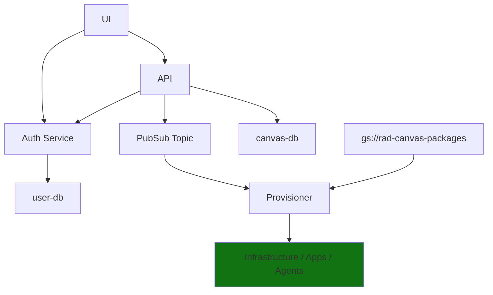

# Cloud Canvas

Manage your infrastructure (and everything else) with diagrams.

## Getting Started

You may need to set the project and authenticate with gcp.

`gcloud auth application-default login`
`gcloud config set project rad-dev-canvas-kwm6`

## Configure, Install, Start

Ask Will for a valid `.env` file for the API. Then it's as simple as....

API

```
cd api
poetry install
make start
```

UI

```
cd ui
npm install
npm start
```

## Deploying To Dev

```
make deploy-ui-cloudbuild-kaniko
make deploy-api-cloudbuild-kaniko
```

## Architecture




<!--

misc for will to clean up

### First-Time Database OR After Model Changes

Only the database needs to be live for this, the api doesn't need to be live.

```
cd api
poetry run alembic upgrade head
```

## Starting the Auth DB, Auth Service, and API Database

`docker compose up database`

In most cases you can do this. The api is configured to use a hosted auth-service. You can always run it locally if you'd like, or if you're doing active development on it.

If you'd like to run it locally via Docker, here's how you'd do that.

`docker compose up database auth-service`
-->
