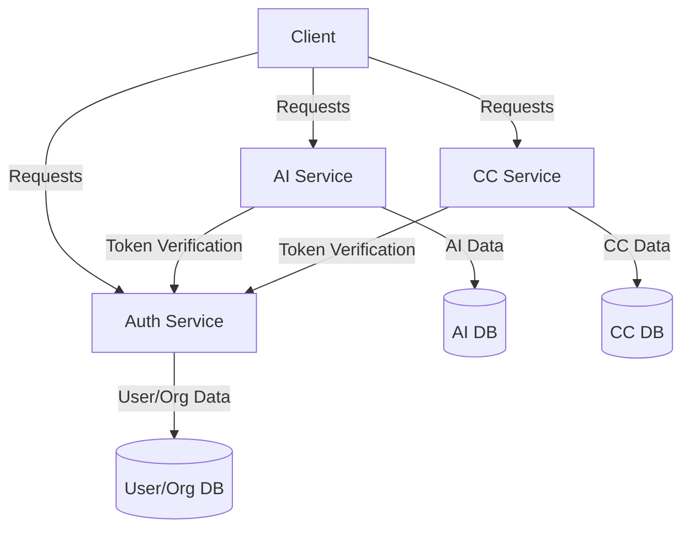

"[python]": {
"editor.formatOnSave": true,
"editor.codeActionsOnSave": {
"source.fixAll": "explicit",
}
},

"ruff.lint.args": [
"--config=pyproject.toml"
],
"ruff.organizeImports": true,
"ruff.fixAll": true,
"editor.formatOnSave": true,
