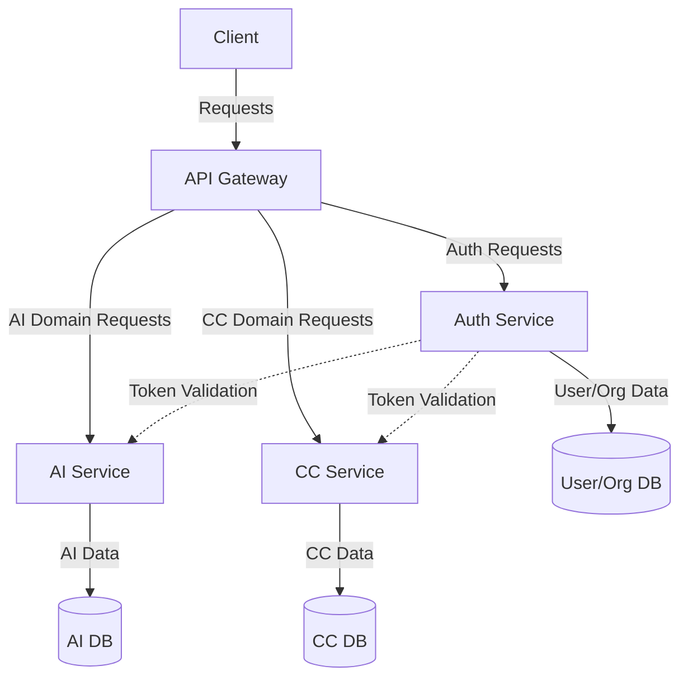

```mermaid
graph TD
    C[Client] -->|Requests| AG[API Gateway]
    AG -->|Auth Requests| AS[Auth Service]
    AG -->|AI Domain Requests| AI[AI Service]
    AG -->|CC Domain Requests| CC[CC Service]
    AS -->|User/Org Data| DB[(User/Org DB)]
    AI -->|AI Data| AIDB[(AI DB)]
    CC -->|CC Data| CCDB[(CC DB)]
    AS -.->|Token Validation| AI
    AS -.->|Token Validation| CC
```
